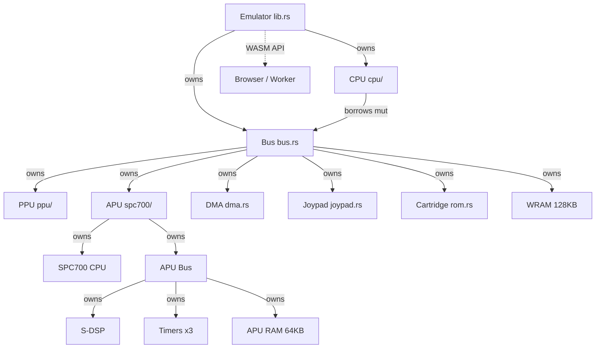
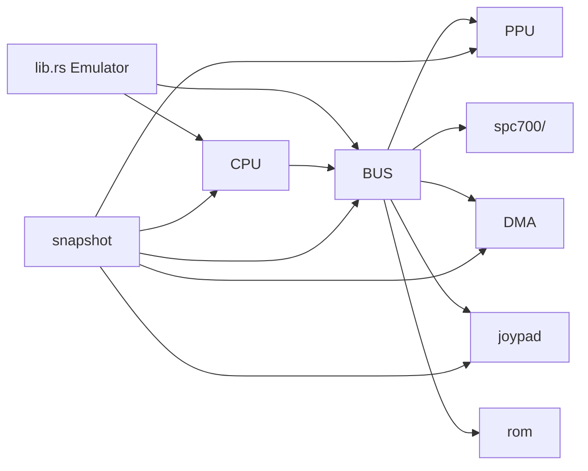
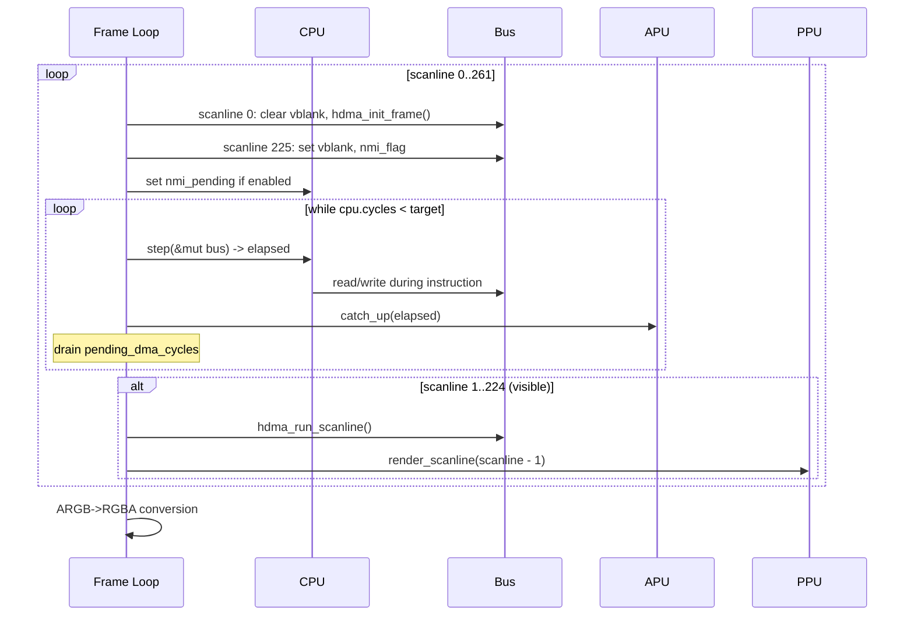

# SNES Emulator -- Architecture Documentation

> Post-architecture-sweep state as of 2026-05-27.
> This document describes the current architecture, not aspirational design.

## System Overview

A Rust SNES emulator targeting LoROM titles (Zelda: ALTTP, Super Mario World).
Compiled to both native (x86_64) and WebAssembly (wasm32). The emulation core
runs 262 scanlines per frame at 1364 master cycles per scanline (NTSC timing).

**What is emulated:**
- 65816 CPU (Ricoh 5A22) -- all 256 opcodes, emulation + native modes
- PPU (S-PPU1/S-PPU2) -- all 8 BG modes, sprites, color math, windows, Mode 7
- APU (SPC700 + S-DSP) -- full audio subsystem with BRR decoding, ADSR/GAIN envelopes, echo FIR, output filter
- DMA (8 channels) -- general DMA and HDMA
- 128KB WRAM, cartridge ROM + SRAM
- Joypad (player 1 serial + auto-read)

**What runs where:**
- Native: `main.rs` (standalone test harness), `bench.rs` (determinism gate)
- WASM: `lib.rs` exposes `Emulator` via `wasm_bindgen`, browser frontend in `web/`
- Worker architecture (Phase B): `emulator-worker.js` runs emulation off main thread

## System Architecture Diagram



## Chip-to-Module Mapping

| Real SNES Chip | Rust Module | Notes |
|---|---|---|
| Ricoh 5A22 (CPU core) | `cpu/mod.rs`, `cpu/instructions.rs`, `cpu/addressing.rs`, `cpu/tables.rs` | 256 opcodes, 22 addressing modes |
| Ricoh 5A22 (DMA engine) | `bus.rs` (execution), `dma.rs` (register state) | DMA execution is in bus.rs due to borrow-checker constraints |
| Ricoh 5A22 (math hardware) | `bus.rs` (write_cpu_register) | 8x8 multiply, 16/8 divide |
| S-PPU1 + S-PPU2 | `ppu/mod.rs`, `ppu/render.rs`, `ppu/color.rs` | Combined into single module (standard practice) |
| Sony SPC700 + S-DSP | `spc700/mod.rs`, `spc700/cpu.rs`, `spc700/dsp.rs`, `spc700/timers.rs` | Independent subsystem with own RAM |
| WRAM (128KB) | `bus.wram` field | Passive memory, owned by bus |
| Cartridge | `rom.rs` | LoROM only (HiROM parsed but not dispatched) |

## Ownership and Synchronization Model

**Ownership tree:**
```
Emulator
  +-- Cpu (registers, cycle counter, interrupt latches)
  +-- Bus
        +-- Ppu (VRAM, OAM, CGRAM, frame_buffer)
        +-- Apu
        |     +-- Spc700 (audio CPU)
        |     +-- ApuBus
        |     |     +-- Dsp (8 voices, echo, noise)
        |     |     +-- Timer[3]
        |     |     +-- ram[64KB]
        |     |     +-- ports_from_main[4], ports_to_main[4]
        |     +-- sample_buffer: Vec<i16>
        |     +-- OutputFilter (private)
        +-- Dma (8 channels, register state only)
        +-- Joypad
        +-- Cartridge (ROM + SRAM)
        +-- wram[128KB]
```

**Clock synchronization:**
- CPU `step()` returns elapsed master cycles
- APU `catch_up(master_cycles)` converts master->SPC cycles (div 21, fractional accumulator) and runs SPC700 + DSP + timers
- PPU is rendered in bulk at scanline boundaries (`render_scanline`)
- DMA cycles are accumulated in `pending_dma_cycles` and added to CPU cycle count after transfer

**No trait abstractions, no Rc/Arc, no callbacks.** Pure structural ownership with mutable borrows.

## Per-Module Details

### CPU (`src/cpu/`)

**Interface:** `step(&mut Bus) -> u64`, `reset(&mut Bus)`, `fetch_byte/word/long()`, `push/pull_byte/word()`, `is_m8()`, `is_x8()`, `update_nz*()`.

**Timing:** Per-instruction. Returns CPU cycles x 6 (fixed multiplier -- real hardware has variable 6/8/12 per address region). Opcode cycle counts from `tables::OPCODE_CYCLES[256]`.

**Key types:** `Cpu` (registers + state), `StatusRegister` (8 boolean flags), `Addr` (bank + address pair from addressing modes).

**Known inaccuracies:**
- *(none — variable bus speed now wired in with per-access 6/8/12 model)*

### PPU (`src/ppu/`)

**Interface:** `write_register(addr, val)`, `read_register(addr) -> u8`, `render_scanline(y)`, `probe_bg_pixel(x, y) -> String`.

**Timing:** Per-scanline. Frame loop sets `ppu.scanline` then calls `render_scanline()`.

**Key types:** `Ppu` (all video state), `BgLayer` (per-background config).

**Known inaccuracies:**
- No mid-scanline rendering
- Mosaic effect not applied
- No interlace/hi-res modes
- No offset-per-tile
- OPHCT hardcoded to 0

### APU (`src/spc700/`)

**Interface:** `catch_up(master_cycles)`, `cpu_read(port) -> u8`, `cpu_write(port, val)`, `drain_samples() -> Vec<i16>`, `dump_dsp_voices() -> String`, `drain_dsp_debug() -> String`, `dsp_reg(addr) -> u8`, `load_spc()`, `snapshot()`, `restore()`.

**Timing:** Catch-up sync. Master cycles / 21 -> SPC cycles. DSP generates one stereo sample every 32 SPC cycles (32 kHz). Cycle-debt mechanism prevents overshoot amplification.

**Key types:** `Apu` (top-level), `Spc700` (audio CPU), `ApuBus` (address space), `Dsp` (8 voices + echo + noise), `Timer`, `OutputFilter` (analog output model).

**Known inaccuracies:**
- Cycle-debt mechanism is not chunk-equivalent (different call patterns with same total cycles produce different SPC instruction boundaries)
- ~200/256 SPC700 opcodes implemented; unimplemented opcodes treated as 2-cycle NOPs

### Bus (`src/bus.rs`)

**Interface:** `read(bank, addr) -> u8`, `write(bank, addr, val)`, `is_pure_memory(bank, addr) -> bool`, `hdma_init_frame()`, `hdma_run_scanline()`.

**Timing:** Dispatch only (no own clock). DMA costs 8 master cycles per byte.

**Key concerns:**
- DMA execution logic (186 lines) is inlined in bus.rs due to Rust borrow-checker constraints (DMA needs to read/write through the bus while being owned by the bus)
- `Bus.read()` takes `&mut self` because some register reads have side effects ($4210 RDNMI, $2180 WMDATA)

### DMA (`src/dma.rs`)

**Interface:** `read(addr) -> u8`, `write(addr, val)`.

**Holds register state only.** Transfer logic lives in `bus.rs::execute_general_dma()` and `bus.rs::hdma_*()`.

**Transfer modes:** 8 patterns in `DMA_TRANSFER_PATTERNS`, sizes in `DMA_TRANSFER_SIZES`.

### Cartridge (`src/rom.rs`)

**Interface:** `load(path) -> Result<Cartridge>` (native only), `read(bank, addr) -> u8`.

**LoROM formula:** `offset = (bank & 0x7F) * 0x8000 + (addr - 0x8000)`.

### Joypad (`src/joypad.rs`)

**Interface:** `set_button(mask, pressed)`, `read_auto() -> u16`, `write_strobe(val)`, `read_serial() -> u8`, `snapshot_state()`, `restore_state()`.

### Snapshot (`src/snapshot.rs`)

Hand-rolled binary serialization. Format: 8-byte magic + version byte + CPU + Bus (containing PPU/DMA/Joypad/APU sub-blobs) + frame_count. No serde dependency.

## Module Dependency Graph



## Frame Loop Sequence



## WASM Boundary Surface

| Export | Purpose | Copy? |
|---|---|---|
| `Emulator::new(rom_data)` | Constructor | ROM copied in (unavoidable) |
| `run_frame_no_return()` | Run one frame (zero-copy) | No copy |
| `framebuffer_ptr/len()` | Canvas data pointer | Zero-copy (JS reads WASM memory) |
| `audio_samples_ptr/len()` | Audio data pointer | Zero-copy |
| `clear_audio_samples()` | Reset audio buffer | No copy |
| `set_button(button, pressed)` | Input | No copy |
| `snapshot() -> Vec<u8>` | Save state | ~200KB copy (necessary) |
| `restore_snapshot(bytes)` | Load state | Copy in |
| `run_frame() -> Vec<u8>` | Legacy (copies framebuffer) | 229KB copy -- deprecated |
| `cpu_opcode_counts() -> Vec<u64>` | Diagnostics | 2KB copy |
| Debug methods | Various | String copies (acceptable for debug) |

**ARGB-to-RGBA conversion** happens per-pixel in the frame loop (57,344 iterations). PPU stores ARGB internally.

## Determinism Contract

For SMW x 600 frames at default reset state:

| Hash | Value |
|---|---|
| `final_fb_hash` | `54b3eed74f9f8432` |
| `final_audio_hash` | `62300ecfc4da23e0` |

Bit-identical across native (x86_64) and browser (wasm32 in Chromium).

**Verification:**
```bash
cargo run --release --bin bench rom/smw.smc 2>&1 | grep hash
```

**What preserves determinism:**
- No HashMap in emulation core
- No floating point in emulation core
- No random number generation
- No platform-conditional logic affecting output (only debug logging is cfg-gated)
- Audio hash uses FNV-1a 64-bit on raw sample bytes (little-endian on all targets)

**Risk: `debug_log: Vec<String>` in DSP** grows unboundedly if not drained. Not in hot path unless debug methods called.

## Feature Flags

| Feature | Purpose | Default |
|---|---|---|
| `trace` | CPU execution trace to stderr | off |
| `cpu-trace` | Compile-time CPU trace (before fetch) | off |
| `vram-trace` | VRAM write logging + debug counters | off |
| `idle-skip` | Idle-loop detection fast path (T10) | off -- audio hash diverges |

## Remaining Issues

These were identified in the architecture assessment but too large to apply in this sweep:

1. **[M] DMA execution in bus.rs** -- 186 lines of transfer logic belongs in dma.rs but can't move due to Rust borrow-checker constraints (DMA reads/writes through the bus while being owned by the bus). Needs a trait or split-borrow pattern.

2. **[L] Privatize struct fields** -- Bus, PPU, CPU, DMA all have pervasive `pub` on fields. Snapshot.rs directly accesses ~100 fields. Requires adding accessor methods and updating snapshot serialization. Started with Joypad (accessor methods added); full sweep is multi-session.

3. ~~**[S] BCD mode**~~ -- **DONE** (sweep 3). ADC/SBC now handle decimal mode with 8 unit tests.

4. ~~**[M] Variable bus speed**~~ -- **DONE**. Per-access 6/8/12 model wired in via `Bus::cpu_read()`/`cpu_write()` wrappers.

5. **[M] HDMA cycle accounting** -- HDMA transfers consume zero cycles; real hardware charges ~8 per byte + overhead.

6. ~~**[S] Deprecate `run_frame()`**~~ -- **DONE**. Marked `#[deprecated]`, bench.rs uses zero-copy path.

7. ~~**[S] Fill missing bus ranges**~~ -- **DONE**. WMADDL/M/H reads ($2181-$2183) return stored values, bank $40-$6F low-area mirrors system area (LoROM) or full ROM (HiROM).

8. ~~**[S] Frame loop reaching into PPU**~~ -- **DONE**. `Ppu::set_scanline()` added, all callers updated.
