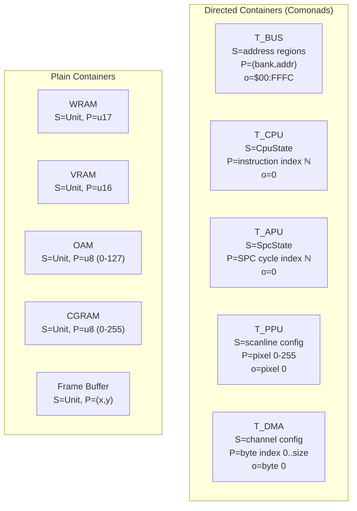
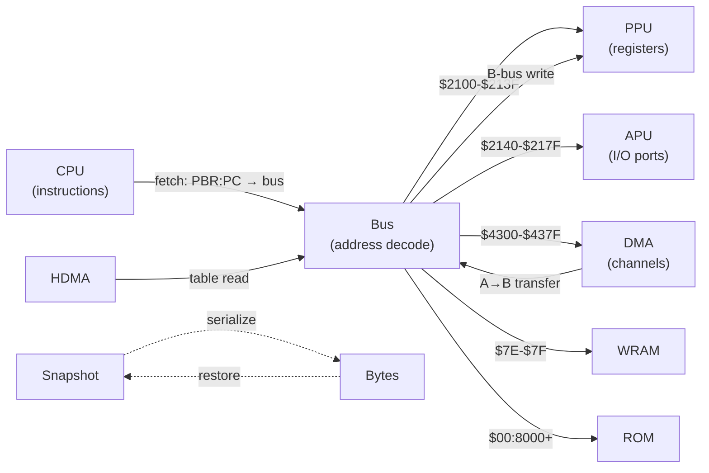

# Categorical Structure of the SNES Emulator

> Post-category-sweep state as of 2026-05-27.
> References: Ahman-Chapman-Uustalu (2014), Abbott-Altenkirch-Ghani (2003).
> Full composition analysis in `docs/container-ghani.md`.

## Overview

The emulator's five hardware subsystems (Bus, CPU, PPU, APU, DMA) compose
via directed containers, distributive laws, and Kleisli arrows in a nested
frame loop. 61 categorical law tests verify the structure. Two composition
bugs were found and fixed during this analysis.

## Container Inventory

Every data structure indexed by positions is a container (S, P).



| Container | Shape S | Positions P | Root o | down | (+) | Type |
|-----------|---------|-------------|--------|------|-----|------|
| T_BUS | Address region config | (bank: u8, addr: u16) | $00:FFFC | Address decode | Bank+addr arithmetic | Directed (on pure memory) |
| T_CPU | CpuState | Instruction index (ℕ) | 0 | Execute n instructions | n + m | Directed (stream) |
| T_APU | SPC700 state | SPC cycle index (ℕ) | 0 | Run n SPC cycles | n + m | Directed (stream) |
| T_PPU | Scanline config | Pixel position 0–255 | 0 | Render context at x | Pixel offset | Directed (finite) |
| T_DMA | Channel config | Byte index 0..size | 0 | Transfer n bytes | n + m | Directed (finite stream) |
| WRAM | Unit | u17 | — | — | — | Plain |
| VRAM | Unit | u16 | — | — | — | Plain |
| OAM | Unit | u8 (0–127) | — | — | — | Plain |
| CGRAM | Unit | u8 (0–255) | — | — | — | Plain |
| Frame buffer | Unit | (x, y) | — | — | — | Plain |

## Directed Container Law Verification

### T_BUS — The Memory Bus

**Stratification:** The bus is a directed container only on the **pure memory** sub-container
(WRAM, ROM, SRAM). At MMIO registers, reads mutate state, breaking Law 1.

The predicate `is_pure_memory(bank, addr)` at `bus.rs:107` is the exact boundary between:
1. **Directed container** (pure memory) — all five laws hold, `extract` is idempotent
2. **Indexed state monad** (MMIO) — reads are Kleisli arrows that transform state

| Law | Statement | Status | Verified by |
|-----|-----------|--------|-------------|
| 1 | down(s, o(s)) = s | ✓ on pure memory | `law1_root_decodes_to_rom` |
| 2 | o(down(s, p)) + p = p | ✓ | `law4_bank_zero_is_identity_base` |
| 3 | down(down(s, p), q) = down(s, p + q) | ✓ on pure memory | 15 aliasing tests |
| 4 | o(s) + p = p | ✓ | `law4_bank_zero_is_identity_base` |
| 5 | (p + q) + r = p + (q + r) | ✓ | `law5_*_associative` (3 tests) |

**Law 3 details:** Bank mirroring ($80→$00 via `& 0x7F`) is an idempotent endomorphism.
WRAM has three alias paths ($7E direct, $00 low mirror, $80 bank mirror) that all
agree on target offset. APU ports ($2140–$217F) are a quotient via `addr & 3`.

**Where laws fail:** $4210 (RDNMI read-clears nmi_flag), $2180 (WMDATA auto-increments
wram_addr), $4016 (Joypad serial advances bit_index). Documented by 4 side-effect tests.

### T_CPU, T_APU — Stream Comonads

Both are the standard stream comonad (Store ℕ). All five laws hold trivially via
properties of natural number addition. The Writer annotation (u64 master cycles per
step) makes each co-Kleisli arrow a monoid homomorphism into (u64, +, 0).

### T_PPU — Scanline Comonad

Rendering pipeline is a nested extraction: BG tile fetch → OBJ fetch → priority
composite → color math → brightness → ARGB conversion. Each stage is a co-Kleisli
arrow for the PPU comonad.

## Container Morphism Diagram



All morphisms now factor through the Bus correctly. DMA and HDMA writes go through
`bus.write()` as of the session fix.

## Composition Taxonomy

The frame loop composes five directed containers at six sites:

| # | Composition | Type | Law | Status |
|---|-------------|------|-----|--------|
| 1 | CPU ∘ Bus | Co-Kleisli (direct) | Sequential borrow | ✓ |
| 2 | CPU ∥ APU | Distributive law | catch_up(a+b) = catch_up(a);catch_up(b) | ✓ FIXED |
| 3 | CPU ; DMA | Degenerate sequential | DMA atomic, add cycles | ✓ |
| 4 | DMA → Bus → PPU | Container morphism chain | Factors through bus.write | ✓ FIXED |
| 5 | HDMA → PPU | Kleisli composition | Write regs then render | ✓ |
| 6 | Frame | Nested Writer monad | Hashes = extract on final state | ✓ |

### Bugs found and fixed

**Bug 1 (Composition #2):** The APU's `cycle_debt: i64` mechanism violated the
distributive law — `catch_up(a+b) ≠ catch_up(a); catch_up(b)`. Fixed by
replacing with `cycle_target: u64` (absolute monotonic target). The distributive
law now holds by construction. Five tests verify chunk-insensitivity.

**Bug 2 (Composition #4):** DMA bypassed `bus.write()` and wrote directly to
`ppu.write_register()` / `apu.cpu_write()`. The container morphism didn't factor
through the Bus. Fixed by routing all DMA and HDMA B-bus writes through
`self.write()`.

## Classical Categorical Structures

| Structure | Type | Location | Well-Formed? |
|-----------|------|----------|--------------|
| `&mut Bus` threading | State monad | cpu/mod.rs | ✓ |
| `cpu.cycles += elapsed` | Writer monad (u64, +) | lib.rs frame loop | ✓ |
| `sample_buffer.push` | Writer monad (Vec, concat) | spc700/mod.rs | ✓ |
| `Result<Cartridge, String>` | Error monad | rom.rs | ✓ |
| Bank mirroring (& 0x7F) | Natural transformation (idempotent) | bus.rs:125 | ✓ |
| APU port mirroring (& 3) | Quotient map | bus.rs:141 | ✓ |
| ARGB → RGBA | Natural transformation | lib.rs:275-281 | ✓ |
| snes_to_argb | Functor (color spaces) | ppu/color.rs | ✓ |
| `op!` macro | Kleisli composition | cpu/instructions.rs:14 | ✓ |
| VRAM remap modes | Permutation group (4 elements) | ppu/mod.rs | ✓ |
| Snapshot ⊣ Restore | Partial adjunction | snapshot.rs | ✓ (partial) |
| OutputFilter | Causal stream arrow | spc700/mod.rs:118-175 | ✓ |
| `is_pure_memory` | Container partition predicate | bus.rs:107 | ✓ |

### Kleisli Categories

**State monad (Bus):** Every CPU instruction is a Kleisli arrow `(Cpu, Bus) → (Cpu, Bus)`.
The `op!` macro is the Kleisli composition combinator — it sequences address resolution
(mutates CPU by advancing PC) with the operation (mutates CPU/Bus via ALU + memory access).

**Writer monad (cycles):** Each scanline's CPU execution is a Kleisli arrow for the Writer
monad `(result, total_cycles)`. The frame loop composes 262 of these. DMA cycles merge
into the Writer via `cpu.cycles += pending_dma_cycles`.

### Co-Kleisli Category (Store comonad)

A bus read `Bus → u8` at a fixed address is a co-Kleisli arrow for the Store comonad.
PPU's `read_register` and APU's `cpu_read` are co-Kleisli arrows extracting values
from the Store. The PPU rendering pipeline is a composition of co-Kleisli arrows:
tile fetch → priority resolve → color math → brightness → format conversion.

### Yoneda Structure

The bus dispatch match (`bus.rs:127-168`) IS the Yoneda embedding — a representable
functor `Hom(-, Region)`. By Yoneda, the entire dispatch is determined by its value at
each address, which is exactly what the match arms encode. Rust compiles this to a
jump table, which is the optimal representation.

No actionable Yoneda optimizations found — the codebase is already fused by construction.

## The Determinism Contract as Comonad Morphism Law

The sacred hashes assert:

```
extract_PPU(run_frame^600(initial_state)) = 54b3eed74f9f8432
extract_APU(run_frame^600(initial_state)) = 62300ecfc4da23e0
```

Snapshot/restore is a comonad morphism where "roots commute":

```
extract ∘ restore ∘ snapshot = extract
```

The hash invariant verifies this law across native/WASM platforms and across code changes.
The round-trip is partial — diagnostic fields (opcode_counts, audio_hash, idle_skip_hits)
are intentionally excluded from serialization as they are not emulation state.

## The Stratification

The bus cleanly partitions into two categorical structures:

```
T_BUS = T_PURE × T_MMIO
```

- **T_PURE** (is_pure_memory = true): Directed container. All five laws hold.
  Extract is idempotent. The idle-loop optimization is safe here.
- **T_MMIO** (is_pure_memory = false): Indexed state monad. Reads are Kleisli
  arrows. Extract mutates the shape. The idle-loop optimization is unsafe here.

The developer discovered this boundary empirically and encoded it as a boolean predicate.
It is the exact comonad/monad boundary.

## Connection to Umbral Calculus

The CPU instruction stream is the stream comonad — the same directed container that
appears in formal power series. The idle-loop optimization detects periodic orbits
(`LDA dp; BEQ -4` repeating) and collapses them via the shift operator. This is safe
on the directed container portion (pure memory) because extract commutes with shift
for idempotent positions.

## Law Test Coverage

| File | Structure | Laws Tested | Count |
|------|-----------|-------------|-------|
| `directed_container_laws.rs` | T_BUS | Laws 1,3,4,5 + aliasing + naturality + side effects | 31 |
| `distributive_law.rs` | CPU ∥ APU | Chunk-insensitivity (5 patterns) | 5 |
| `functor_laws.rs` | snes_to_argb | Identity, absorption, monotonicity, independence | 9 |
| `functor_laws.rs` | StatusRegister | Section-retraction roundtrip (exhaustive 256) | 3 |
| `functor_laws.rs` | Snapshot | Round-trip adjunction (CPU, WRAM, SRAM, PPU, idempotent) | 5 |
| `functor_laws.rs` | VRAM remap | Permutation bijectivity (modes 0-3) + high-bit preservation | 5 |
| `functor_laws.rs` | Writer monad | Unit, associativity, overflow headroom | 3 |
| **Total** | | | **61** |

## What Category Theory Can't Tell You

1. **Timing accuracy** — whether the fixed ×6 master cycle multiplier is correct
   (hardware measurement, not abstraction)
2. **Game compatibility** — whether specific games depend on cycle-exact behavior
3. **Audio quality** — whether the OutputFilter sounds right (psychoacoustic question)
4. **The idle-skip interaction problem** — the remaining audio divergence is an
   assumption violation (skip elides CPU-APU interaction), not a law violation
5. **VRAM remap bit patterns** — the specific permutations come from SNES hardware
   documentation, not from categorical reasoning
6. **Performance** — category theory shows what CAN be optimized (stream comonad
   shift) but not WHETHER it's worth the complexity
